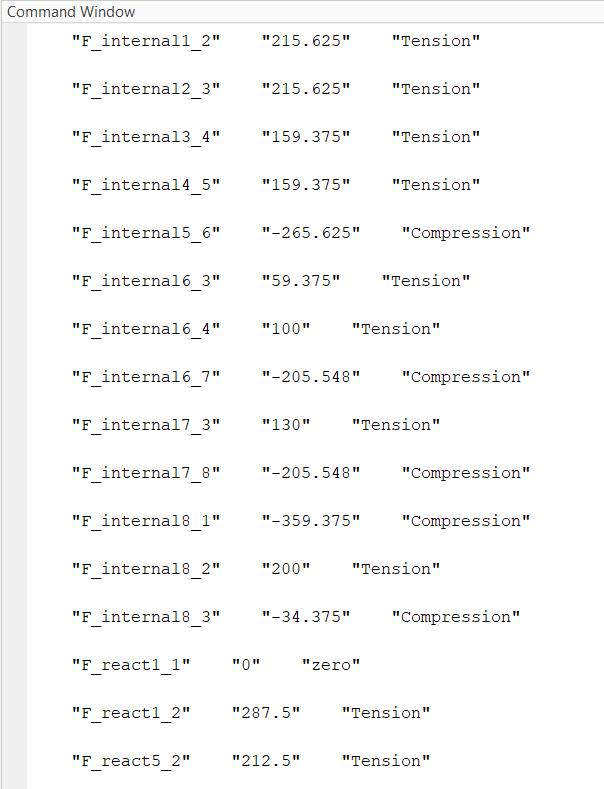
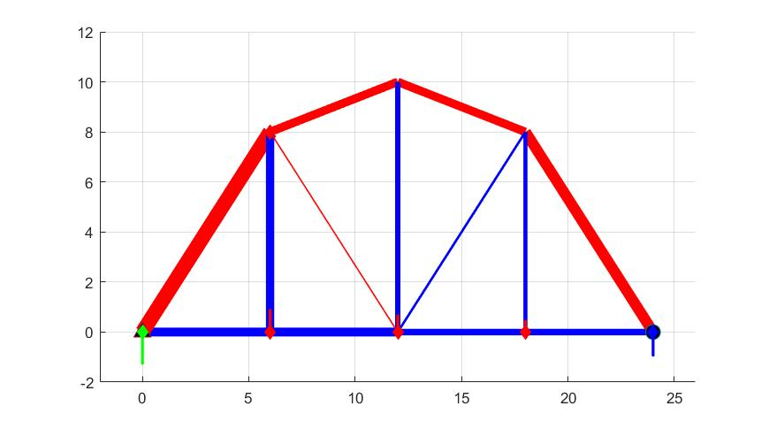

# Structural Calculators

## How to use "Truss.m"
Open the file "Truss.m" input:
0. Decide whether you would like to calculate internal forces or not (internal forces could only be calculated on truss structures)
1. Input nodes coordinates in "nodes"
2. Input elements, from node a to node b in "elements"
3. Input support type, i.e. how many unkown reactions are there on each node, in "SupportTypesOnNodes"
4. Input external forces or moments in "ExF" and "ExM" respectively
5. Run
6. Obtained results: internal forces on each element, and reaction forces on each supporting nodes.

## How to use "truss_DSM.m"
Open the file "truss_DSM.m" input:
1. Input nodes coordinates in "nodes"
2. Input elements, from node a to node b in "ele"
3. Input geometry properties, which is a vector that contains properties of each element
4. Input support types, 2 means both x and y are constrained; 12 means y constrained, 11 means x constrained, in "Supporting"
5. Input external forces or moments in "ExF" and "ExM" respectively
6. Run
7. Obtained results: displacement of each degrees of fredom, internal forces on each element, and reaction forces on each supporting nodes.

## How to use "Frame"
Similar with "Truss", but you can input load in this script. See annotation in the script.
Obtained results: reaction forces on each supporting nodes.

## Demostration on "Truss"

