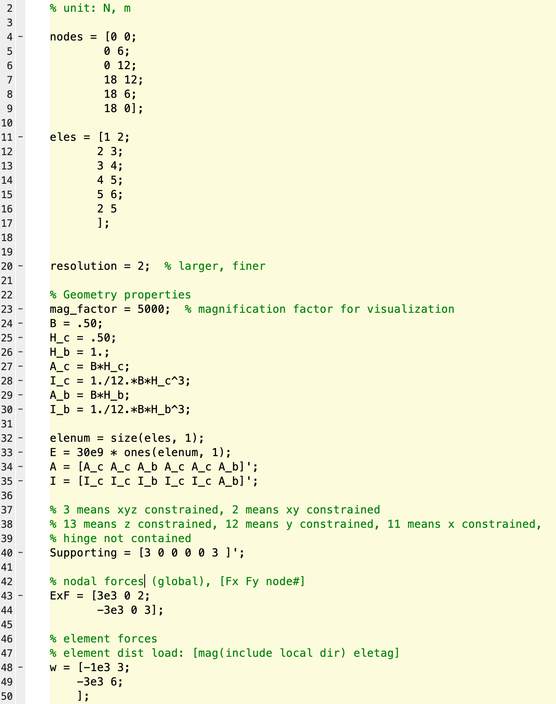

# Structural Calculators
"frame_DSM.m" and "truss_DSM.m" are two script files that implementing the direct stifness method using MATLAB codes. "truss.m" is an implementation of the method of joists to solve truss structure under nodal forces.
## How to use "frame_DSM.m"
Open the file "frame_DSM.m" input:
1. Input nodes coordinates in "nodes" (See left figure below line 4-9)
2. Input elements, from node a to node b in "eles" (See left figure below line 11-17)
3. Modify the geometry properties (See left figure below line 22-35)
4. Input support types, as instructed by the comments
5. Input external nodal forces and element equivalent forecs
6. Run
7. Obtained results: displacement of each degrees, element end forces, and reaction forces on each supporting nodes, and a simple visualization of the structure, you can change the variable "mag_factor" to exaggerate the deformation.

“resolution” relates to the level of finess of visualization. If you would like to check the element end forces, change "resolution" to 0.

## Demostration on "frame_DSM.m"

  
  

## Demostration on "Truss.m"

  
  

"truss_DSM.m" can provide exactly the same result (but no visualization).
